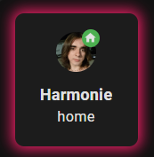

# hha-cards


HHA Cards, `aka: Harmonie Home Assistant Cards`, is a collection of cool customizable cards for Home Assistant. (HA)

## Table of Contents

- [Installation](#installation)
- [How To Use](#how-to-use)
- [Cards List](#cards-list)
  - [Person Card](#person-card)
- [Contributing](#contributing)
- [Donate](#donate)

## Installation

### HACS Installation (Recommended)
Use this button to add the repository to your HACS:

[](https://my.home-assistant.io/redirect/hacs_repository/?owner=harmonie-durrant&repository=hha-cards&category=frontend)

or follow these steps:
1. Add this repository to HACS by including it as a custom repository:
  - Go to `HACS` > `Integrations` > `⋮` > `Custom repositories`.
  - Paste the URL of this repository and select Lovelace as the category.
2. Install the Entity Progress Card from HACS.

### Manual Installation

1. Clone the repository into the `/config/www/` directory in your Home Assistant setup.
2. Add `/local/hha-cards/dist/index.js` to your Lovelace resources
```yaml
url: /local/hha-cards/dist/index.js
type: module
```
3. if you are updating just replace the old file with the new and clear your browser cache.

## How to use

Every card is available in the visual editor, the setup is quite straightforward, but here is an example of how to use each card:

### Person Card



```yaml
type: custom:hha-person-card
entity: person.harmonie
charge_state_entity: sensor.harmonie_phone_battery_state
layout: vertical
charging_color: var(--pink-color)
grid_options:
  columns: 3
  rows: 2
```

### Room Card


```yaml
type: custom:hha-room-card
name: Harmonie's Room
heating: input_boolean.harmonie_heating
cooling: input_boolean.harmonie_cooling
layout: horizontal
icon: mdi:bed
color: var(--pink-color)
heating_color: var(--red-color)
cooling_color: var(--info-color)
```

## Contributing

Feel free to fork this repo and submit your changes through pull requests, or to suggest a feature/report a bug, make an issue in the issues tab of this repository.

When developing run `npm install` to setup the project, and `npm run build` or `npm run watch` to build the project. (The watch command will automatically rebuild the project when you save a file)

## Donate

[Buy me a coffee.](https://buymeacoffee.com/harmonie)
